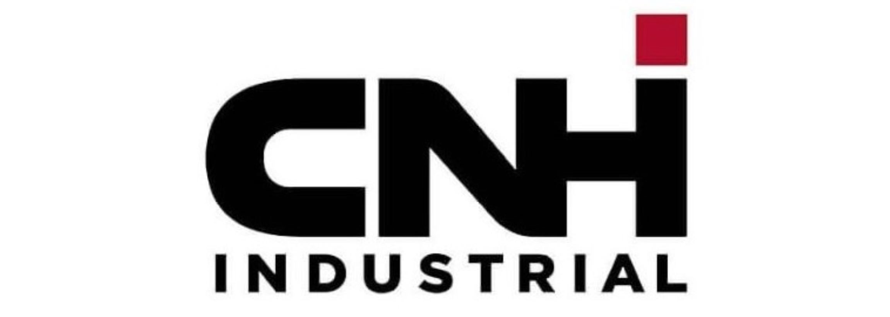
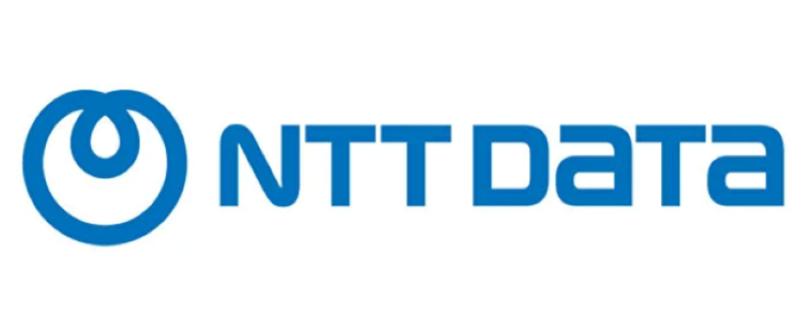

  
  

    <h2 class="position-title">Master’s Thesis Student</h2>
    
March 2024 – December 2024 · Belgium

    

      <a href="https://www.cnh.com" target="_blank">CNH INDUSTRIAL BELGIUM NV</a>
    

    

      - Conducted research on Zero-Shot and Open-Vocabulary Object Detection (ZSOD and OSD) for agricultural applications, focusing on crop kernel detection to enable real-time grain loss assessment.  
      - Evaluated state-of-the-art models (OWLv2 and YOLO-World) using different query embedding techniques (CLIP, DINOv2) to asses kernel detection performance.
    

  

  

    <h2 class="position-title">AI Intern</h2>
    
August 2023 – September 2023 · Bulgaria (Remote)

    

      MLPS AD
    

    

      - Developed a license plate recognition system as part of an internship, leveraging OpenCV for image processing and Tesseract OCR for text extraction to accurately detect and recognize alphanumeric characters.  
      - Implemented a BRISQUE-based no-reference image quality assessment system using Python, leveraging OpenCV, SciPy, and libSVM to calculate quality scores and identify the best-quality images from a user-provided dataset. 
      - Implemented object detection using a pre-trained SSD MobileNet model, enhanced with Grad-CAM for class activation visualization, and developed a color detection pipeline leveraging K-Means clustering and RGB matching for precise feature-based analysis.
    

  

  
  

    <h2 class="position-title">Junior Big Data Engineer</h2>
    
December 2021 – August 2022 · Istanbul, Turkey

    

      <a href="https://nttdata-solutions.com/tr/" target="_blank">NTT DATA Business Solutions</a>
    

    

      - Worked on the DMP project for ZF Global as a data engineering consultant. 
      - Designed and implemented data transformation scripts with PySpark and SQL through Databricks and Synapse. 
      - Integrated new source systems (manufacturing execution systems) into a common unified data model, improving data consistency and reliability for the serving layer, which is an angular app + PowerBI report showing OEE for respective plant. 
      - Following CI/CD principles and maintaining development, staging and production environments for the product. 
      - Ensured the stability of the product through bug fixing and performance improvements. 
      - Implementing important data engineering concepts such as row level security, multi hop architecture, fault tolerant data ingestion, test driven development, proper documentation and version control. 
      - Collaborated effectively with a multinational team & customer through pair programming, knowledge transfer and sprint DEMO sessions.
    

  

---

  
  

    <h2 class="position-title">Candidate Engineer</h2>
    
March 2021 – December 2021 · Ankara, Turkey

    

      <a href="https://www.havelsan.com/en" target="_blank">HAVELSAN</a>
    

    

      - Contributed to the autonomous ground vehicle project (BARKAN), focusing on network design. 
      - Implemented VLAN tagging, GRE tunnel, and OSPF protocol on Linux using Quagga software.
    

  

---

  
  

    <h2 class="position-title">Summer Intern</h2>
    
Summer 2020 · Ankara, Turkey

    

      <a href="https://www.havelsan.com/en" target="_blank">HAVELSAN</a>
    

    

      - Worked at the Robotic and Autonomous Systems Department. 
      - Implemented OSPF protocol for mesh networks on Cisco Packet Tracer. 
      - Attended training sessions on project management, test engineering, and cyber security.
    

  

---

  
  

    <h2 class="position-title">Summer Intern</h2>
    
Summer 2019 · Ankara, Turkey

    

      <a href="https://www.roketsan.com.tr/en" target="_blank">ROKETSAN</a>
    

    

      - Worked at the Launching System Design Department. 
      - Implemented UART communication protocol using VHDL on Vivado and tested on PicoZed FMC Carrier Card.
    

  

