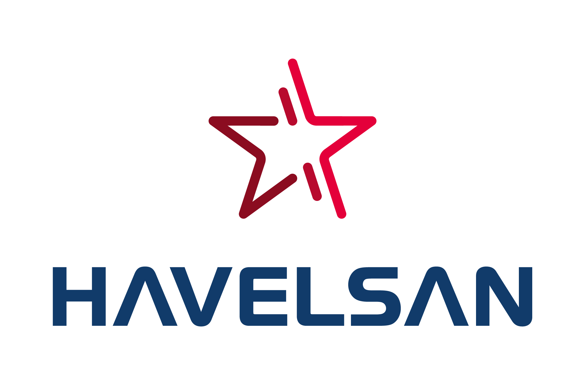

##  Master’s Thesis Student
**CNH INDUSTRIAL BELGIUM NV**  
March 2024 – December 2024 · Belgium  
Conducted research on Zero-Shot and Open-Vocabulary Object Detection (ZSOD and OSD) for agricultural applications, focusing on crop kernel detection to enable real-time grain loss assessment. Evaluated state-of-the-art models (OWLv2 and YOLO-World) using advanced query embedding techniques (CLIP, DINOv2) and prompt tuning, analyzing the impact of pre-processing strategies and expanded datasets on detection performance. This work highlights key challenges and advancements in adapting ZSOD models for domain-specific agricultural systems.

---

## Summer Intern (Remote)
**MLPS AD**  
August 2023 - September 2023  
- Developed a license plate recognition system using OpenCV and Tesseract OCR.
- Implemented a BRISQUE-based no-reference image quality assessment system using Python, OpenCV, SciPy, and libSVM.
- Enhanced object detection with SSD MobileNet, Grad-CAM, and a color detection pipeline with K-Means clustering.

---

##  Junior Big Data Engineer
**NTT DATA Business Solutions**  
December 2021 – August 2022 · Istanbul, Turkey  
- Worked on the DMP project for ZF Global as a data engineering consultant.
- Designed and implemented data transformation scripts with PySpark and SQL through Databricks and Synapse.
- Integrated new source systems (manufacturing execution systems) into a common unified data model, improving data consistency and reliability for the serving layer, which is an angular app + PowerBI report showing OEE for respective plant.
- Following CI/CD principles and maintaining development, staging and production environments for the product.
- Ensured the stability of the product through bug fixing and performance improvements.
- Implementing important data engineering concepts such as row level security, multi hop architecture, fault tolerant data ingestion, test driven development, proper documentation and version control.
- Collaborated effectively with a multinational team & customer through pair programming, knowledge transfer and sprint DEMO sessions.

---

##  Candidate Engineer
**HAVELSAN**  
March 2021 – December 2021 · Ankara, Turkey  
- Contributed to the autonomous ground vehicle project (BARKAN), focusing on network design.
- Implemented VLAN tagging, GRE tunnel, and OSPF protocol on Linux using Quagga software.

---

##  Summer Intern
**HAVELSAN**  
Summer 2020  
- Worked at the Robotic and Autonomous Systems Department
- Implemented OSPF protocol for mesh networks on Cisco Packet Tracer.
- Attended training sessions on project management, test engineering, and cybersecurity.

---

##  Summer Intern
**ROKETSAN**  
Summer 2019 · Ankara, Turkey  
- Worked at the Launching System Design Department.
- Implemented UART communication protocol using VHDL on Vivado and tested on PicoZed FMC Carrier Card.
