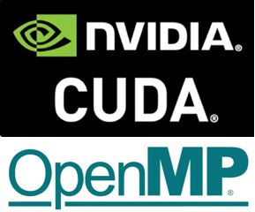
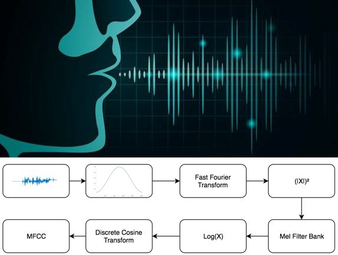
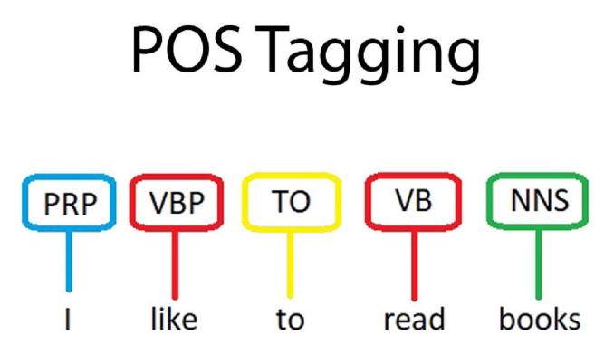
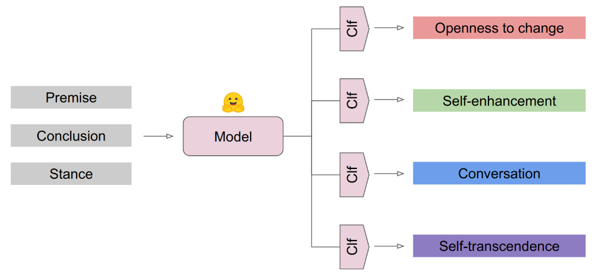
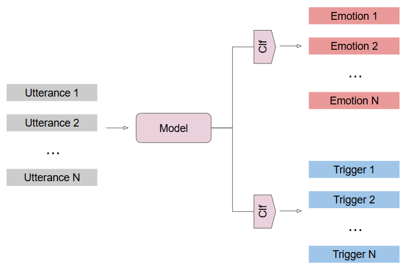

  

    
    

      <h2>One/Zero Shot Vehicle Detection on Satellite Images using Image/Text Queries</h2>
      
Implemented and evaluated two open-vocabulary object detection models, OWL-ViT and YOLO-WORLD, for detecting vehicle classes in satellite images using both text and image queries. OWL-ViT demonstrated strong zero-shot performance for common classes like "car" but struggled with fine-grained distinctions, while excelling in one-shot settings with image queries due to its image similarity capabilities. YOLO-WORLD improved after fine-tuning with image embeddings, highlighting the potential of one/zero-shot object detection for diverse and specialized classes.

      

        <a href="https://github.com/pelinsuacar/MLCV_project">GitHub Repository</a>
        <a href="https://github.com/pelinsuacar/MLCV_project/blob/main/MLCV_PROJECT_REPORT_PELINSU_ACAR.pdf">View Report (PDF)</a>
      

    

  

  

    
    

      <h2>Parallelization of the Bellman-Ford Algorithm</h2>
      
Developed and implemented parallelized versions of the Bellman-Ford algorithm using OpenMP and CUDA. Designed and evaluated CPU-based parallelization (OpenMP) with dynamic, static, and auto scheduling strategies, and GPU-based parallelization (CUDA) with varying thread and block configurations. Demonstrated that OpenMP outperforms for small inputs due to minimal overhead, while CUDA achieves substantial speedups for medium and large datasets (up to 264x).

      

        <a href="https://github.com/pelinsuacar/parallel_bellman_ford_implementation">GitHub Repository</a>
        <a href="https://github.com/pelinsuacar/parallel_bellman_ford_implementation/blob/main/pelinsu_acar_project_report.pdf">View Report (PDF)</a>
      

    

  

  

    
    

      <h2>Multi-Courier Problem (MCP) Optimization</h2>
      
Developed and compared four models—Constraint Programming (CP), Boolean Satisfiability (SAT), Satisfiability Modulo Theories (SMT), and Mixed-Integer Programming (MIP)—to optimize courier assignment and routing for minimizing total travel distance. Utilized standard Vehicle Routing Problem methodologies and achieved optimal solutions for small-scale instances while identifying limitations in SAT and SMT for larger instances.

      

        <a href="https://github.com/pelinsuacar/CDMO_Project">GitHub Repository</a>
        <a href="https://github.com/pelinsuacar/CDMO_Project/blob/main/CDMO_Project_Report.pdf">View Report (PDF)</a>
      

    

  

 
    
    

      <h2>Anti-Covid19 Systems</h2>
      
Designed an IoT application to check the face mask and body temperature of people using peripheral devices (temperature sensor, servo motor, LCD screen, Bluetooth module, Webcam), Arduino UNO, and Raspberry Pi4. Implemented facial recognition and detected unmasked faces utilizing OpenCV. Displayed the data on an Android application and sent notifications to users.

      

        <a href="https://www.youtube.com/watch?v=Hjg5IJv0Vv4" target="_blank">Video Link</a>
        <a href="https://docs.google.com/gview?url=https://raw.githubusercontent.com/pelinsuacar/pelinsuacar.github.io/master/files/anti-covid19.pptx&embedded=true" target="_blank">View Slides</a>
      

    

  

    
    

      <h2>Spoken Number Recognition System</h2>
      
Designed a spoken number recognition system on Vivado using Basys3 and analog components. Designed a PCB for filtering and amplification of speech signals. Implemented algorithms like Hamming Window, FFT, and MFCC in Vivado and displayed the recognized number on a 7-segment display.

      

        <a href="https://docs.google.com/gview?url=https://raw.githubusercontent.com/pelinsuacar/pelinsuacar.github.io/master/files/Spoken Number Recognition.pdf&embedded=true" target="_blank">View Report (PDF)</a>
      

    

  

  

    
    

      <h2>Recurrent Neural Models for Sequence Labeling</h2>
      
Developed a part-of-speech (POS) tagging solution using Long Short-Term Memory (LSTM) models, achieving an F1-score of 0.91 on a test set of 13,676 elements. The best-performing model utilized an embedding layer, two bidirectional layers, and a fully connected layer, implemented in TensorFlow.

      

        <a href="https://github.com/pelinsuacar/NLP_Projects/blob/main/Assignment1.ipynb">GitHub Repository</a>
        <a href="https://github.com/pelinsuacar/NLP_Projects/blob/main/NLP_A1.pdf">View Report (PDF)</a>
      

    

  

  

    
    

      <h2>Multi-label Text Classification with Transformers</h2>
      
Designed and evaluated BERT-based classifiers to detect human value categories in textual arguments, achieving an F1-score of 0.65 and an average accuracy of 0.70. The best-performing model integrated argument conclusion, premise, and stance as input, utilizing Hugging Face Transformers with PyTorch

      

        <a href="https://github.com/pelinsuacar/NLP_Projects/blob/main/Assignment2.ipynb">GitHub Repository</a>
        <a href="https://github.com/pelinsuacar/NLP_Projects/blob/main/NLP_A2.pdf">View Report (PDF)</a>
      

    

  

    
  

    
    

      <h2>Emotion Discovery and Reasoning its Flip in Conversation</h2>
      
Developed a BERT-based system to identify emotions and detect emotional shifts in conversational dialogues, leveraging specialized classification heads for trigger and emotion detection. The model, tested with frozen and fully fine-tuned configurations, outperformed baseline classifiers in trigger detection but revealed challenges in emotion classification. Insights from class-wise analysis and error examination provide directions for future improvements in emotional discourse analysis.

      

        <a href="https://github.com/pelinsuacar/NLP_Projects/blob/main/NLP_project_Acar_Carkaxhia_Diaconu_Korsten.ipynb">GitHub Repository</a>
        <a href="https://github.com/pelinsuacar/NLP_Projects/blob/main/NLP_project_report_Acar_Carkaxhia_Diaconu_Korsten.pdf">View Report (PDF)</a>
      

    

  

  

    
    

      <h2>Tameable Snake</h2>
      
Implemented a Deep Q Neural Network for the Snake game using Tensorflow and trained the snake with reward and state mechanism.

      

        <a href="https://docs.google.com/gview?url=https://raw.githubusercontent.com/pelinsuacar/pelinsuacar.github.io/master/files/temable snake.pdf&embedded=true" target="_blank">View Report (PDF)</a>
      

    

  

