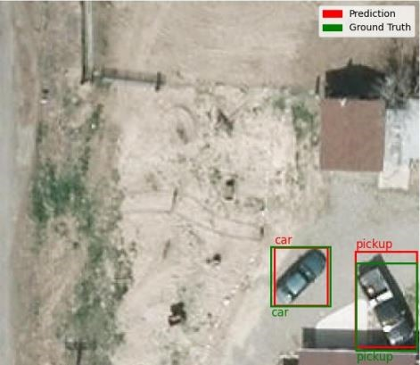
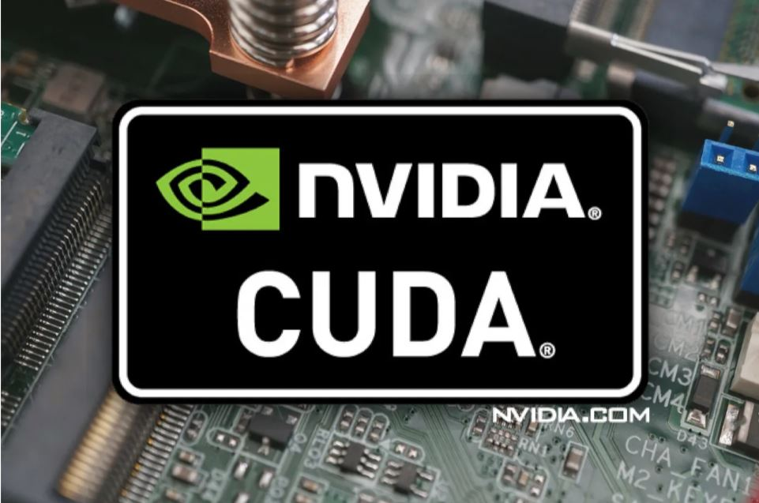
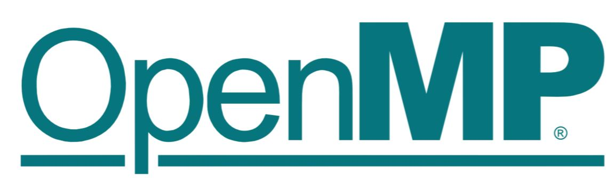
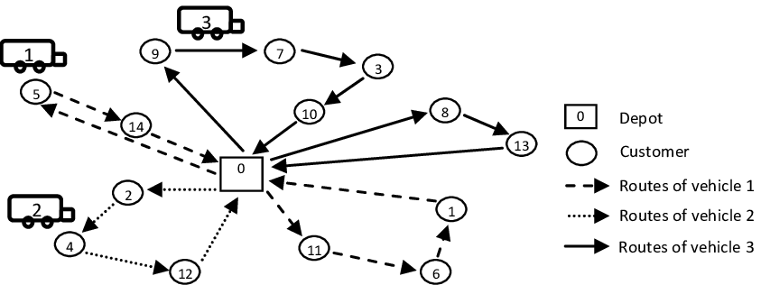
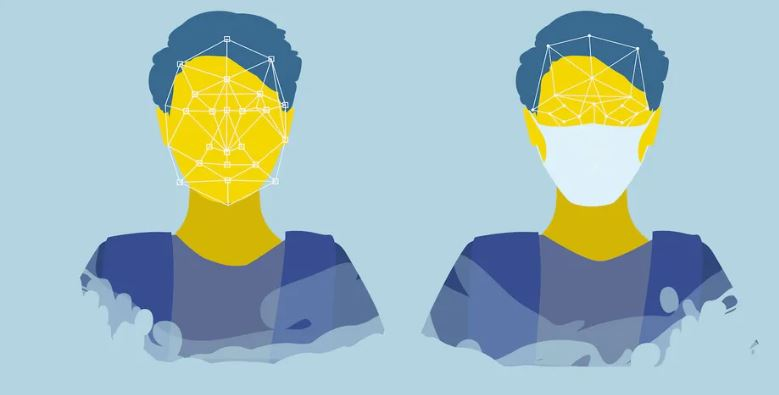
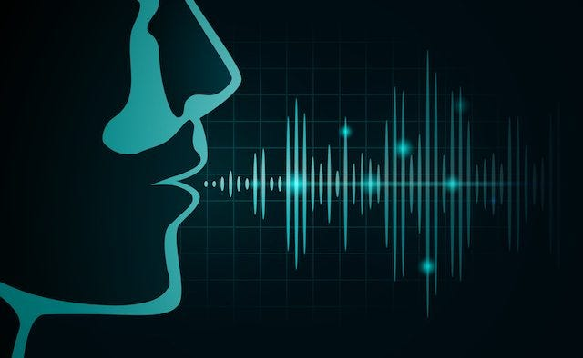
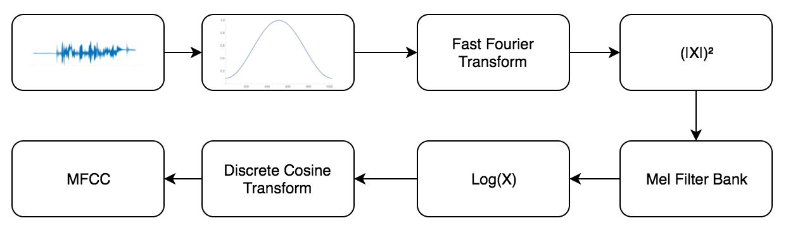

### One/Zero Shot Vehicle Detection on Satellite Images using Image/Text Queries

Implemented and evaluated two open-vocabulary object detection models, OWL-ViT and YOLO-WORLD, for detecting vehicle classes in satellite images using both text and image queries. OWL-ViT, leveraging its COCO pre-training on image-text pairs, demonstrated strong zero-shot performance for common classes like "car" but struggled with fine-grained distinctions, while excelling in one-shot settings with image queries due to its image similarity capabilities. YOLO-WORLD initially showed limited zero-shot performance, particularly with image queries, but improved after fine-tuning with image embeddings, as evidenced by better clustering of vehicle types in t-SNE analysis. This work highlights the potential of one/zero-shot object detection for diverse and specialized classes, emphasizing the need for more fine-grained feature extraction.

[GitHub Repository](https://github.com/pelinsuacar/MLCV_project)  
[View Report (PDF)](https://github.com/pelinsuacar/MLCV_project/blob/main/MLCV_PROJECT_REPORT_PELINSU_ACAR.pdf)

### Parallelization of the Bellman-Ford Algorithm

  
  

Developed and implemented parallelized versions of the Bellman-Ford algorithm for shortest path computation in graphs using OpenMP and CUDA. Designed and evaluated CPU-based parallelization (OpenMP) with dynamic, static, and auto scheduling strategies and GPU-based parallelization (CUDA) with varying thread and block configurations. Demonstrated that OpenMP outperforms for small inputs due to minimal overhead, while CUDA achieves substantial speedups for medium and large datasets (up to 264x). Highlighted GPU efficiency gains through parallel processing and proposed future optimizations, such as shared memory utilization, to further improve CUDA performance for large-scale graphs.

[GitHub Repository](https://github.com/pelinsuacar/parallel_bellman_ford_implementation)  
[View Report (PDF)](https://github.com/pelinsuacar/parallel_bellman_ford_implementation/blob/main/pelinsu_acar_project_report.pdf)

### Natural Language Processing Mini-Projects

1) Developed a part-of-speech (POS) tagging solution using Long Short-Term Memory (LSTM) models, achieving an F1-score of 0.91 on a test set of 13,676 elements. The best-performing model utilized an embedding layer, two bidirectional layers, and a fully connected layer, implemented in TensorFlow.

[Code](https://github.com/pelinsuacar/NLP_Projects/blob/main/Assignment1.ipynb)  
[View Report (PDF)](https://github.com/pelinsuacar/NLP_Projects/blob/main/NLP_A1.pdf)
   
2) Designed and evaluated BERT-based classifiers to detect human value categories in textual arguments, achieving an F1-score of 0.65 and an average accuracy of 0.70. The best-performing model integrated argument conclusion, premise, and stance as input, utilizing Hugging Face Transformers with PyTorch.

[Code](https://github.com/pelinsuacar/NLP_Projects/blob/main/Assignment2.ipynb)  
[View Report (PDF)](https://github.com/pelinsuacar/NLP_Projects/blob/main/NLP_A2.pdf)
   
3) Developed a BERT-based system to identify emotions and detect emotional shifts in conversational dialogues, leveraging specialized classification heads for trigger and emotion detection. The model, tested with frozen and fully fine-tuned configurations, outperformed baseline classifiers in trigger detection but revealed challenges in emotion classification. Insights from class-wise analysis and error examination provide directions for future improvements in emotional discourse analysis.

[Code](https://github.com/pelinsuacar/NLP_Projects/blob/main/NLP_project_Acar_Carkaxhia_Diaconu_Korsten.ipynb)  
[View Report (PDF)](https://github.com/pelinsuacar/NLP_Projects/blob/main/NLP_project_report_Acar_Carkaxhia_Diaconu_Korsten.pdf)

### Multi-Courier Problem (MCP) Optimization

Developed and compared four models—Constraint Programming (CP), Boolean Satisfiability (SAT), Satisfiability Modulo Theories (SMT), and Mixed-Integer Programming (MIP)—to optimize courier assignment and routing for minimizing total travel distance. Utilized standard Vehicle Routing Problem methodologies, including successor matrix and predecessor array approaches. Achieved optimal solutions for small-scale instances (e.g. 10 couriers, 13 instances) and identified limitations in SAT and SMT for larger instances. Demonstrated proficiency in mathematical modeling, problem-solving, and optimization techniques.
  
[GitHub Repository](https://github.com/pelinsuacar/CDMO_Project)  
[View Report (PDF)](https://github.com/pelinsuacar/CDMO_Project/blob/main/CDMO_Project_Report.pdf)

### Anti-Covid19 Systems

Designed an IOT application to check the face mask and the body temperature of people using peripheral devices(temperature sensor, servo motor, LCD screen, Bluetooth module, Webcam), Arduino UNO and Raspberry Pi4. Implemented facial recognition and detected unmasked faces utilizing OpenCV. Displayed the data on the Android application and sent notifications to users.

[Video Link](https://www.youtube.com/watch?v=Hjg5IJv0Vv4) 

### Spoken Number Recognition System

  
  

Designed a spoken number recognition system on Vivado using Basys3 and some analog components. Designed a PCB for the filtering and amplification of speech signals. Utilized the internal ADC of Basys3 for sampling. Implemented a hamming window, FFT, and MFCC algorithms in Vivado and displayed the recognized number on 7-segment display. 

